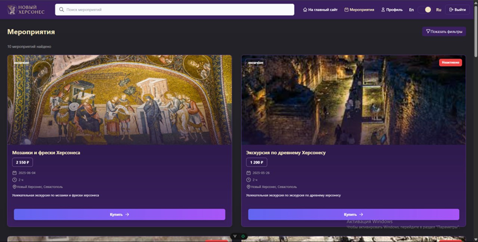
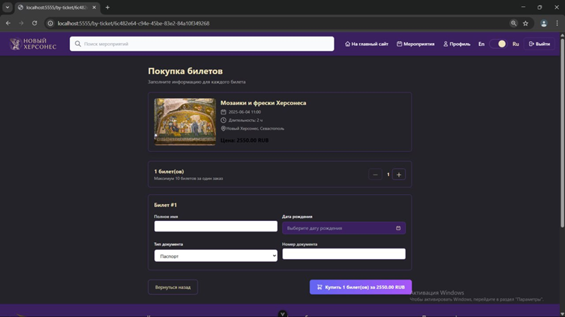
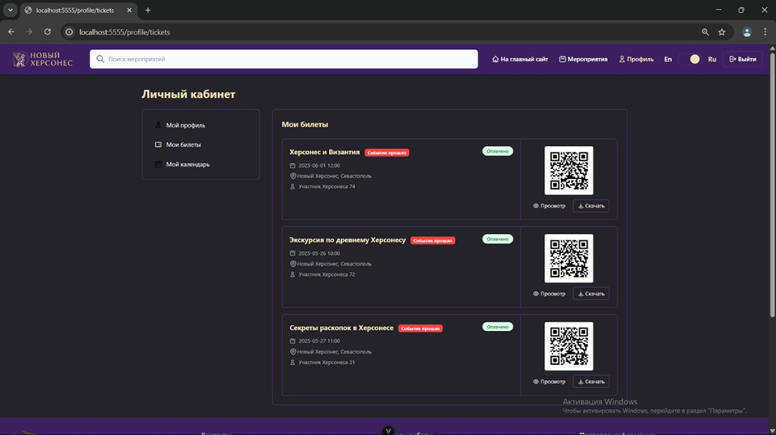
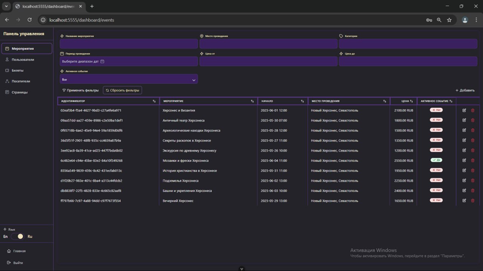
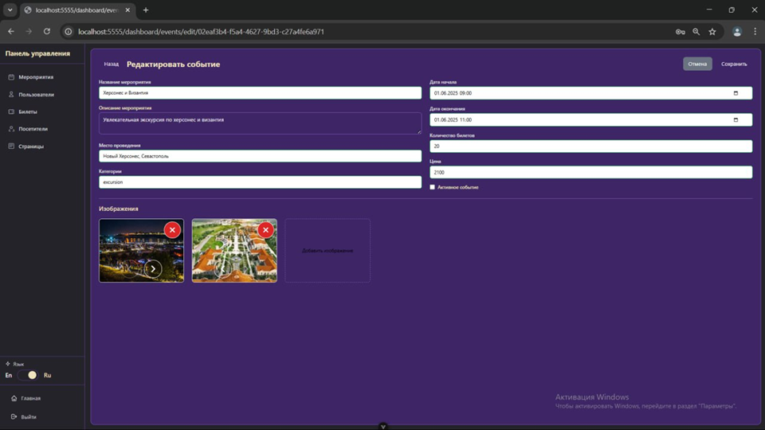

# New Khersones — сайт для Нового Херсонеса в Севастополе

Этот проект был создан в рамках проектной деятельности и представляет собой веб-приложение, посвящённое Новому Херсонесу в Севастополе. Приложение разработано с использованием Vue 3, TailwindCSS и PWA для поддержки мобильной версии и офлайн-режима.

## О проекте

Сайт позволяет пользователю:

- просматривать список актуальных событий;
- оформлять покупку билетов (без интеграции с онлайн-оплатой);
- зарегистрироваться и авторизоваться в системе;
- управлять своими билетами в личном кабинете;
- использовать встроенный календарь событий с возможностью добавления заметок.

Для администраторов реализована отдельная панель управления, включающая:

- полную работу с событиями (создание, редактирование, удаление);
- управление билетами;
- фильтрацию и просмотр данных пользователей и посещаемости.

## Используемые технологии

- Vue 3
- TailwindCSS
- Pinia
- Vue Router
- PWA (Progressive Web App)

## Требования

- Node.js версии 16 или выше
- npm версии 8 или выше
- Vue 3


## Настройка API и домена

Перед запуском в продакшене необходимо указать адрес backend-сервера и домен, с которого работает клиентское приложение.
Гитхаб backend: https://github.com/pshenichnikov-artem/New-Khersones-backend

1. Откройте файл: src/constants/api.ts

Замените значение `API_BASE_URL` на актуальный адрес вашего backend:

```ts
export const API_BASE_URL = "https://your-backend-url.com/api";
```

2. Откройте файл: vite.config.ts

В настройках сервера (server.origin) укажите домен, на котором будет размещено клиентское приложение:

```json
server: {
  origin: 'https://your-frontend-domain.com',
  ...
}
```









